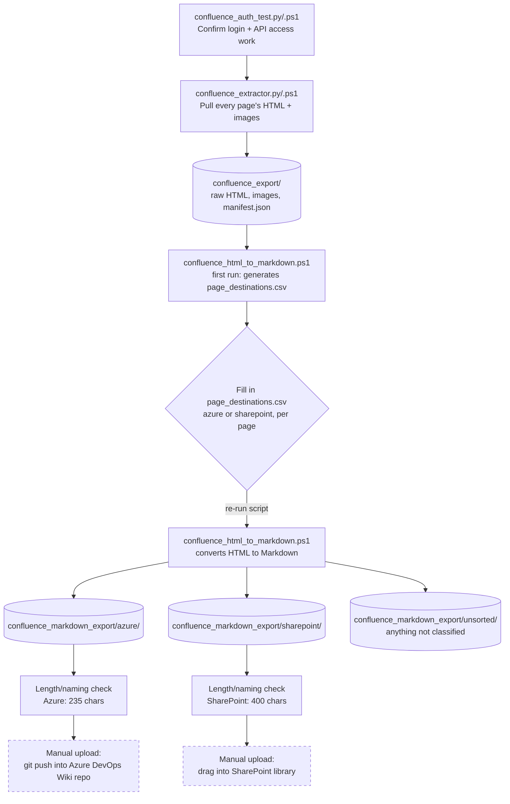

# How the Confluence Migration Pipeline Works

This is the short version of what the scripts in this repo actually do, start to finish. Five stages, each one hands off to the next.

*(Dashed boxes at the end are the one piece not built yet, still manual.)*

## Stage by stage

### 1. Confirm access works
`confluence_auth_test.py` or `confluence_auth_test.ps1`, run one of them first. Logs in with your normal Confluence username and password (asked for at runtime, never stored in the file), fetches one page as a test. If it works, you're clear to move on. If it doesn't, this is where SSL certificate issues or permission problems show up, better to find that out on one page than 200 pages into a real run.

### 2. Pull everything down
`confluence_extractor.py` or `.ps1`. Walks every page in the space, saves the raw HTML content and downloads every image, writes it all into `confluence_export/`, one folder per page, plus a `manifest.json` that lists what's there. If a page fails partway through, it's logged and skipped rather than stopping the whole run.

### 3. Classify each page
The first time `confluence_html_to_markdown.ps1` runs, it can't yet convert anything, because it doesn't know which pages are technical (Azure DevOps Wiki) versus everything else (SharePoint). So instead, it generates `page_destinations.csv`, one row per page, and stops. This gets filled in by hand, `azure` or `sharepoint` against each title, since there's no reliable way to guess that from content alone.

### 4. Convert to Markdown
Run the same script again once the CSV's filled in. Each page's HTML gets converted to real Markdown, headings, tables, links, images, code blocks, the lot, and routed into `confluence_markdown_export/azure/`, `.../sharepoint/`, or `.../unsorted/` (anything left unclassified). Images are copied alongside each page so the output folder is self-contained.

### 5. Check it'll actually upload
Still part of the same script run. For whichever destinations have pages, it checks every file's path length against that platform's real limit, Azure's stricter 235 characters (and it turns spaces into hyphens), SharePoint's more generous 400. Anything too long gets flagged, with the option to auto-shorten so nothing fails on upload later.

### 6. Push it to the destination — not built yet
This is the one gap. Getting the finished `.md` files into Azure DevOps Wiki (which is git-backed, so this would mean cloning the wiki's repo and pushing) or into a SharePoint document library (a different process entirely, likely the Graph API or PnP PowerShell) hasn't been built. Right now this step is manual.

## Where things actually stand

- [x] Access confirmed working
- [x] Full extraction built
- [x] Markdown conversion + destination classification built
- [ ] Automated upload to Azure DevOps Wiki / SharePoint

## A couple of things worth remembering

- **Nothing here needs admin access.** Every step uses the same read permission you already have browsing Confluence normally.
- **No credentials are ever stored.** Every script asks for your username and password at runtime and never writes them anywhere.
- **The raw export is never touched by later steps.** `confluence_export/` stays untouched even if you re-run the Markdown conversion, so nothing's ever lost by re-running a later stage.
